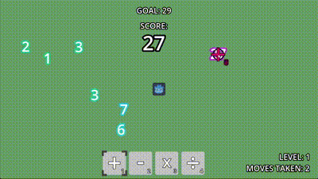

<!-- PROJECT LOGO -->
 

  

    
  

<h3 align="center">Math Problems!!</h3>

  Get the specified goal by throwing the numbers on each other with four basic operations!
  

    
  <h2 align="center">
    <a href="https://fuczek.itch.io/math-problems">View Demo</a>
         
         
      </h2>
  

<!-- ABOUT THE PROJECT -->
## About The Project

A project made to challenge myself in creating a fun educational game. You throw numbers on each other until you get the value the game asks you for. The game counts the amount of moves and upps the difficulty of the provided numbers and the goal with each level.

I might develop the game further expanding on the various abilities, limiting the certain operations to a specific amounts, or creating full-fledged equations with PEMDAS support. Expanding on the animations and graphics would also be required.

This project is finished for now.

### Built With

Godot 4.2 using GDScript

<!-- GETTING STARTED -->
## Getting Started

To get a local copy up and running clone the repo and open it in a Godot Engine 4.2. There are no additional steps.
